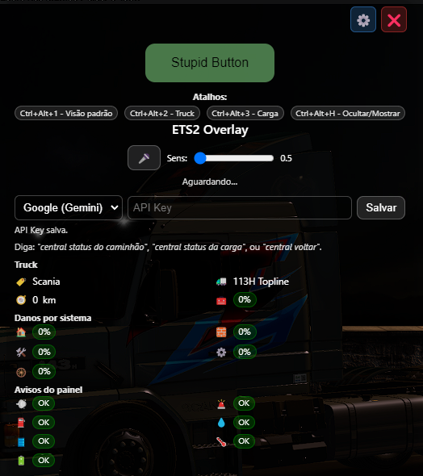
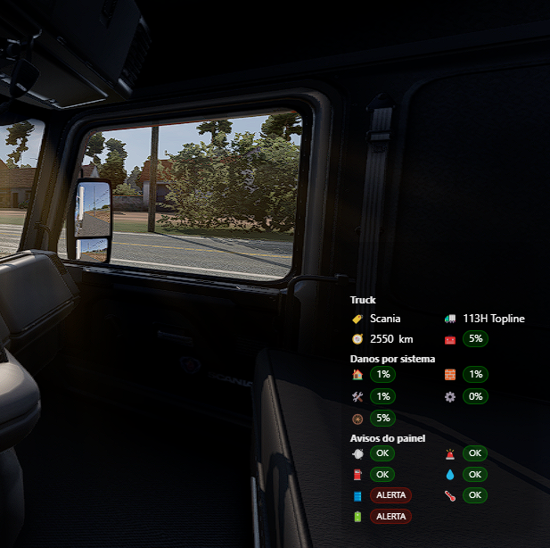
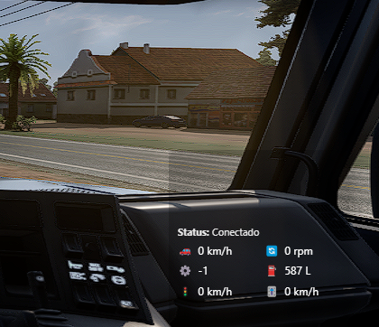
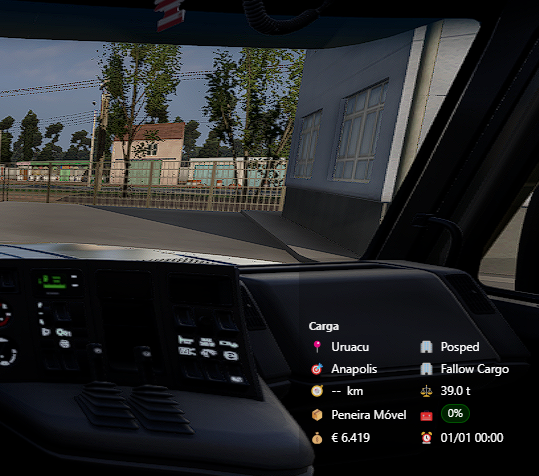

# 🚛 ETS2 Overlay - Versão de Auditoria

## 🌟 Transforme sua Experiência de Simulação

**Imagine ter todas as informações cruciais do seu caminhão sempre à vista, sem nunca perder o foco da estrada.** 

Este overlay revolucionário para **Euro Truck Simulator 2** e **American Truck Simulator** oferece uma experiência de telemetria em tempo real como nunca vista antes. Com uma interface elegante e sempre visível, você terá controle total sobre cada aspecto da sua jornada.

### 🎮 Por que Este Overlay é Especial?

- **🔥 Sempre Visível**: Interface flutuante que nunca atrapalha sua gameplay
- **⚡ Tempo Real**: Dados instantâneos direto do motor do jogo
- **🎯 Múltiplas Visões**: Alterne entre informações do caminhão, carga e navegação
- **🚀 Zero Configuração**: Funciona imediatamente após a instalação
- **💎 Interface Moderna**: Design limpo e profissional que complementa o jogo
- **🔧 Totalmente Gratuito**: Sem custos ocultos ou limitações

### 🛣️ Eleve Seu Realismo ao Próximo Nível

Seja você um caminhoneiro virtual experiente ou um iniciante explorando as estradas europeias e americanas, este overlay oferece insights valiosos que transformarão sua forma de jogar. Monitore combustível, danos, navegação e muito mais - tudo em uma interface intuitiva que se integra perfeitamente ao seu gameplay.

## 🚀 Funcionalidades Principais

### 📊 Telemetria em Tempo Real
- **Velocidade, RPM e marcha** do veículo
- **Combustível e sistemas** do caminhão
- **Navegação e destino** da rota
- **Status da carga** transportada
- **Avisos do painel** e alertas
- **Danos do veículo** e componentes

### 🎮 Interface Interativa
- **Sempre no topo** e transparente
- **Arrastável** pela tela
- **Múltiplas visões** (padrão, caminhão, carga)
- **Atalhos de teclado** para navegação rápida
- **Modo foco** para interação

## 📸 Capturas de Tela

### Interface Principal

*Visão geral do overlay com informações principais do caminhão*

### *Detalhes técnicos e status dos sistemas do veículo*

### *Informações sobre velocidade - marcha - RPM - Combustivel e etc*

### *Informações sobre a mercadoria transportada e rota*

---

## 🛠️ Especificações Técnicas

### Plataforma e Sistema
- **SO**: Windows 10+ (recomendado)
- **Runtime**: Electron 31.x
- **Node.js**: 18+
- **Arquitetura**: x64

### Jogos Suportados
- Euro Truck Simulator 2 (ETS2)
- American Truck Simulator (ATS)

### Linguagem e Dependências
- **JavaScript ES2022**
- **trucksim-telemetry**: ^0.21.0
- **canvas-confetti**: ^1.9.3
- **dotenv**: ^16.6.1

## ⌨️ Atalhos de Teclado

| Atalho | Função |
|--------|--------|
| `Ctrl + Alt + 1` | Visão padrão (resumo geral) |
| `Ctrl + Alt + 2` | Visão do caminhão (detalhes técnicos) |
| `Ctrl + Alt + 3` | Visão da carga (informações de transporte) |
| `Ctrl + Alt + H` | Alternar modo foco/clique-através |

#### 🎤 Comandos de Voz Inteligentes
- **OpenAI Whisper**: Conversão de áudio em texto (speech-to-text)
- **Google Gemini**: Processamento de linguagem natural para interpretar comandos
- **Funcionalidade**: Permite controlar o overlay através de comandos falados em português

#### 🗣️ Comandos Suportados
- *"Central, status do caminhão"* → Alternar para visão do caminhão
- *"Central, status da carga"* → Alternar para visão da carga  
- *"Central, voltar"* → Retornar à visão padrão

### 🔄 Alternativa Disponível
**Você NÃO precisa das APIs!** O projeto funciona perfeitamente usando apenas:

| Comando de Voz (Removido) | Atalho de Teclado (Disponível) |
|---------------------------|--------------------------------|
| "Status do caminhão" | `Ctrl + Alt + 2` |
| "Status da carga" | `Ctrl + Alt + 3` |
| "Voltar" | `Ctrl + Alt + 1` |
| "Modo foco" | `Ctrl + Alt + H` |

### ⚡ Vantagens dos Atalhos
- ✅ **Sem custos** de API
- ✅ **Resposta instantânea** (sem latência de rede)
- ✅ **Funciona offline** completamente
- ✅ **Sem configuração** adicional necessária
- ✅ **Mais rápido** que comandos de voz

## 🎯 Configuração de Telemetria

### Requisitos do Jogo
1. **Plugin de telemetria** instalado (ex: scs-telemetry.dll)
2. **Jogo em execução** com perfil carregado
3. **Telemetria habilitada** nas configurações do jogo

### Configuração no Jogo
1. Abra ETS2/ATS
2. Carregue seu perfil
3. Verifique se a telemetria está ativa
4. Inicie uma viagem ou modo livre

### Configuração no Aplicativo
1. Execute o overlay
2. Aguarde a conexão automática
3. Verifique o status no rodapé da aplicação

### Verificação de Conexão
- **🟢 Conectado**: Dados sendo recebidos normalmente
- **🟡 Aguardando**: Tentando conectar com o jogo
- **🔴 Desconectado**: Sem comunicação com a telemetria

## 📱 Ícones e Indicadores

### Status da Telemetria
- 🟢 **Conectado** - Recebendo dados
- 🟡 **Aguardando** - Tentando conectar
- 🔴 **Erro** - Falha na conexão

### Veículo
- 🚗 **Velocidade** - Velocidade atual
- 🔄 **RPM** - Rotação do motor
- ⚙️ **Marcha** - Marcha engatada
- ⛽ **Combustível** - Nível do tanque
- 🚦 **Limite** - Velocidade máxima da via
- 🎚️ **Cruzeiro** - Controle de velocidade

### Navegação
- 🧭 **Distância** - Até o destino
- 📍 **Origem** - Cidade de partida
- 🎯 **Destino** - Cidade de chegada
- 🛣️ **Rota** - Informações da estrada

### Carga
- 📦 **Tipo** - Mercadoria transportada
- ⚖️ **Peso** - Massa da carga
- 🧰 **Dano** - Estado da mercadoria
- 💰 **Valor** - Informações comerciais

### Sistema
- 🔋 **Bateria** - Voltagem elétrica
- 🌡️ **Temperatura** - Motor e sistemas
- 🛢️ **Óleo** - Pressão e nível
- 💨 **Ar** - Sistema pneumático

### Alertas
- ⚠️ **Aviso** - Atenção necessária
- 🚨 **Crítico** - Ação imediata
- ℹ️ **Info** - Informação geral
- ✅ **OK** - Sistema normal

## 🔧 Solução de Problemas

### Telemetria não conecta
1. Verifique se o jogo está rodando
2. Confirme a instalação do plugin de telemetria
3. Carregue um perfil no jogo
4. Reinicie o overlay se necessário

### Overlay não aparece
1. Verifique se está sempre no topo
2. Tente mover com Alt+Tab
3. Reinicie a aplicação
4. Verifique as configurações de exibição

### Performance baixa
1. Atualize drivers gráficos

## 📄 Licença

**Restrições**:
- ❌ Uso comercial sem autorização
- ❌ Revenda ou sublicenciamento
- ❌ Distribuição com fins lucrativos

---

**Desenvolvido para demonstração técnica e auditoria de código**

*Esta versão mantém apenas as funcionalidades essenciais de telemetria para análise e estudo.*

